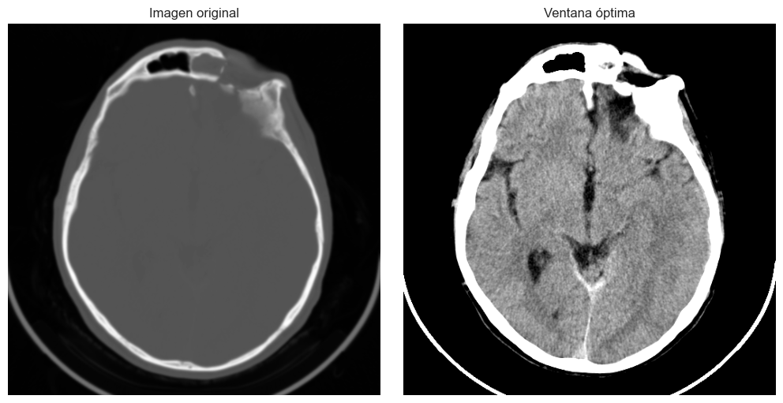
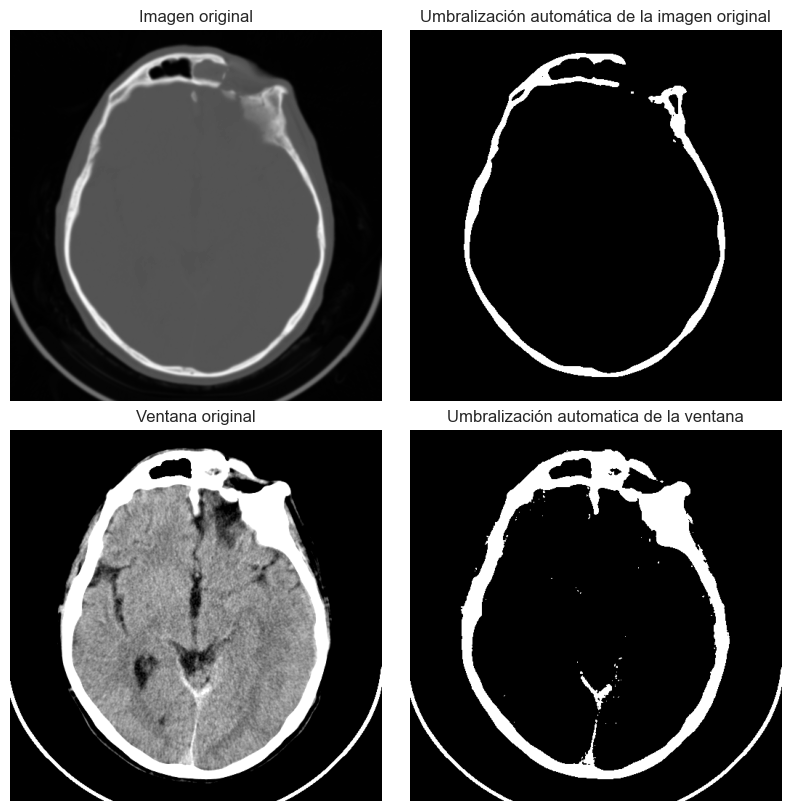
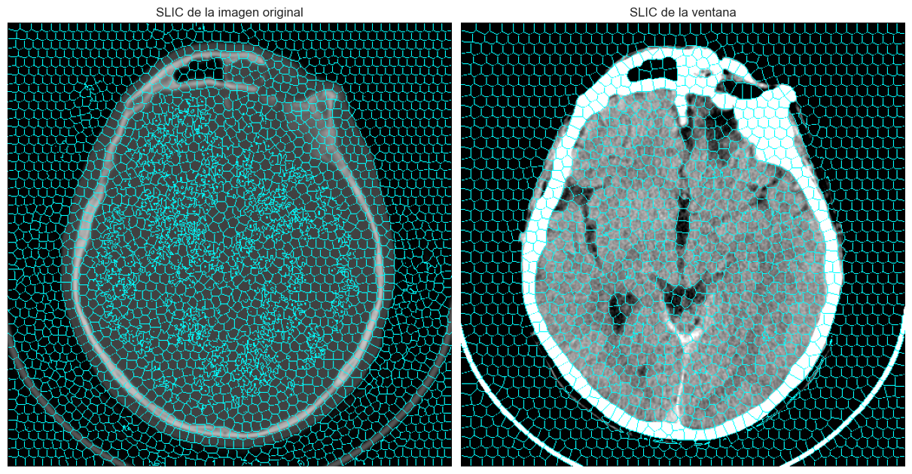

# 🧠 Segmentación de Imágenes Médicas con Python

Este proyecto explora diversas técnicas de segmentación de imágenes médicas aplicadas a una tomografía computarizada (TC) craneal, utilizando algoritmos de umbralización y generación de superpíxeles.

## 🧾 Descripción del Proyecto

La práctica se centra en la implementación de técnicas de segmentación para destacar estructuras anatómicas relevantes del tejido cerebral en una imagen DICOM. Se han empleado métodos clásicos de umbralización, filtrado y el algoritmo SLIC para superpíxeles.

## ⚙️ Tecnologías y Librerías

- `numpy`: operaciones de matrices y estadísticas.
- `matplotlib`: visualización de imágenes y resultados.
- `pydicom`: lectura de imágenes DICOM.
- `cv2` (OpenCV): procesamiento avanzado de imágenes, incluyendo SLIC.

## 📸 Procesamiento Realizado

### 1. Umbralización manual

Se aplica una ventana de visualización previamente optimizada para el tejido encefálico. Permite distinguir zonas que no son visibles en la imagen original, aunque se pierde detalle óseo.

### 2. Umbralización automática iterativa

Se implementa un algoritmo de umbralización basado en medias de grupos que converge hasta una diferencia mínima entre iteraciones. 

🔁 Al aplicar el algoritmo una o dos veces:
- **Ventana**: 1 iteración permite diferenciar adecuadamente la región encefálica.
- **Imagen original**: 2 iteraciones permiten segmentar correctamente el cráneo.

### 3. Umbralización automática con prefiltrado

Se utiliza un filtro gaussiano (5x5, σ=1) antes de la umbralización:

- **Imagen original**: no mejora sustancialmente.
- **Ventana**: reduce el ruido residual, mejora ligeramente la segmentación.

### 4. Segmentación con SLIC (superpíxeles)

Se aplica el algoritmo **Simple Linear Iterative Clustering** para dividir la imagen en regiones homogéneas:

- **Imagen original**: resultado aceptable, especialmente en el cráneo, menos preciso en tejido blando.
- **Ventana**: excelente adaptación a los bordes anatómicos.

Parámetros ajustados:
- Tamaño de superpíxeles: 10–12
- Compacidad: 1–5
- Iteraciones: 20–100

## ✅ Conclusión

Este proyecto demuestra cómo combinar técnicas clásicas y modernas para mejorar la segmentación de imágenes médicas.
